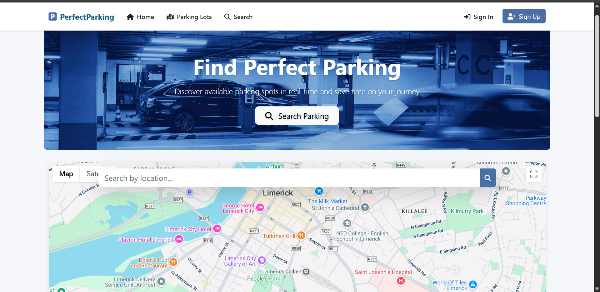
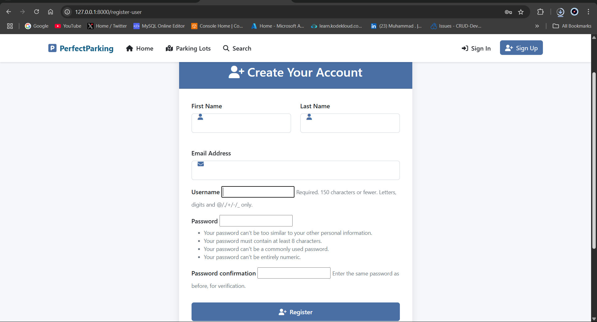
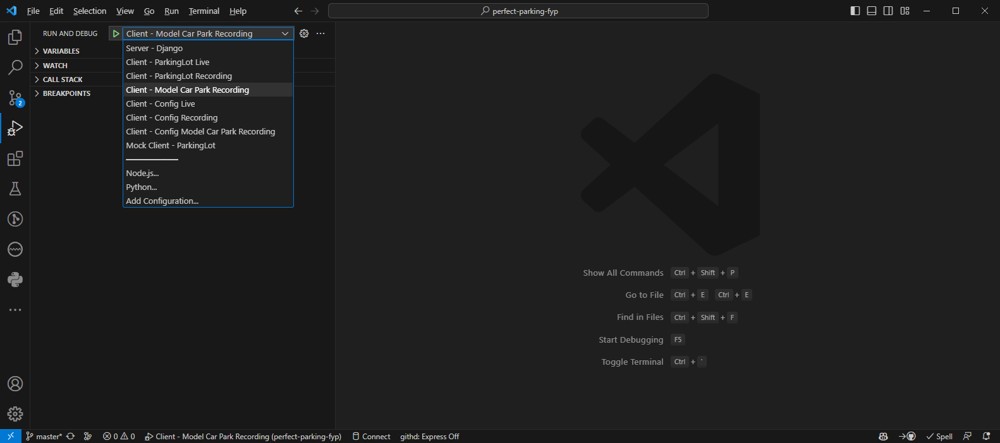
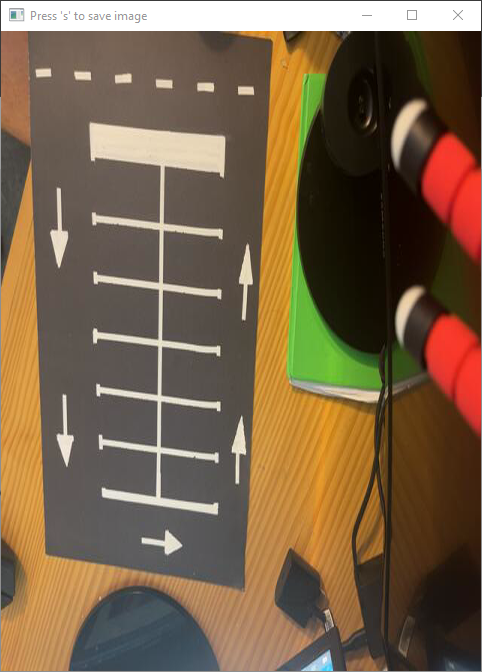
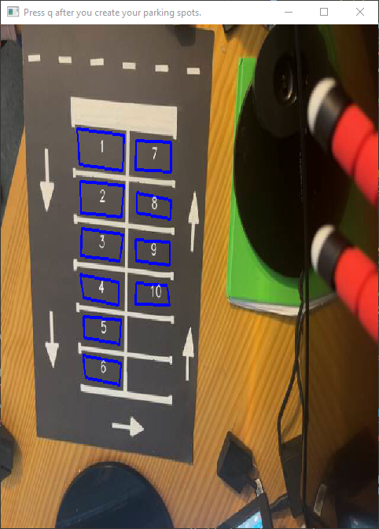
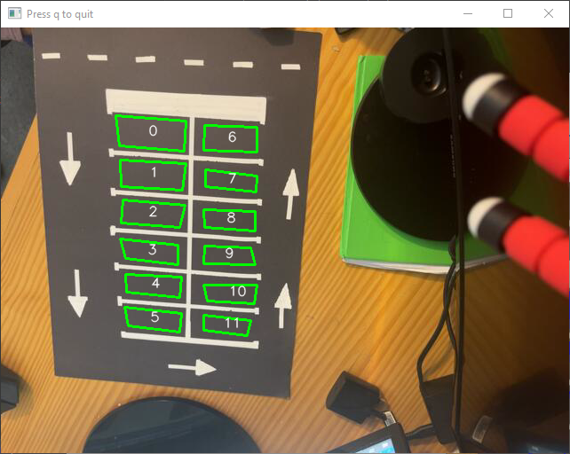
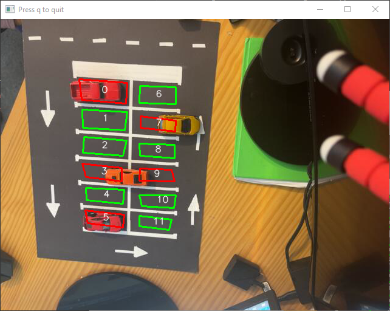

# [Parking App FYP ](https://github.com/rhysquilter/perfect-parking-fyp/)

This App aims to create a parking system that will replace outdated systems and help stop the widespread problem that is parking in our cities. The goal of this project is to improve the effectiveness of finding parking spaces and to also relieve the stress of the users looking for parking by implementing new and innovative features. This will be done by building a client-server API and website that will show the user exactly where the parking is. The server will be supported by parking monitor clients powered by OpenCV to detect if a parking spot has been filled or made empty.

## Requirements

- [Python 3.9](https://www.python.org/downloads/) - Python is a programming language that lets you work quickly and integrate systems more effectively. Version installed must be 3.9 to avoid any dependency issues.

### IDEs

- [VS Code](https://code.visualstudio.com/) - Code editing.Redefined. Free. Built on open source. Runs everywhere.[^vs-code]

### Source Code Management

- [Git](https://git-scm.com/) is a free and open-source distributed version control system designed to handle everything from small to very large projects with speed and efficiency.
- [GitHub](https://www.github.com) is a web-based hosting service for version control using Git. It offers all of the distributed version control and source code management (SCM) functionality of Git as well as adding its features.
- [GitHub Desktop](https://desktop.github.com/) - Simple collaboration from your desktop
- [WinMerge](https://winmerge.org/) is an Open Source differencing and merging tool for Windows.

### Mobile Apps for Camera Feeds

- [DroidCam](https://www.dev47apps.com/) - Use your [Android](https://play.google.com/store/apps/details?id=com.dev47apps.droidcam) or [IPhone](https://apps.apple.com/ie/app/droidcam-webcam-obs-camera/id1510258102) as a webcam on your computer over WiFi or USB.

## Run Application

Clone the repository

```bash
git clone https://github.com/muhammad21236/Parking_App_FYP.git
```

There are three applications in this project: the website server, a client parking monitor and a mock client parking monitor.

### Run Website Server

1. Install dependencies

   - With Pip (To fast execute, run on Windows [pip-install.bat](./pip-install.bat))

     ```bash
     pip install -r requirements.txt
     ```
2. Run the app
   Open VS Code and run the app by selecting the `Run and Debug` (`Ctrl + Shift + D`) tab and selecting `Server - Django` from the dropdown menu. Then click the green play button to run the app, or
   Open a terminal and run the following command:

   ```bash
   python manage.py runserver
   ```
3. Open the app in your browser
   [http://localhost:8000
   ](http://localhost:8000)

   

   

#### Built-in User Accounts

Built-in user accounts are:

| Username       | Password   | Role  | Note                             |
| -------------- | ---------- | ----- | -------------------------------- |
| john           | John123456 | admin | Built in admin account           |
| admin1         | letmein    | admin | Built in admin account           |
| parkingMonitor | Letmein1$  | user  | Account for parking monitor apps |

## 🌍 Google Maps API Key Setup

This project uses the **Google Maps JavaScript API** to display maps and location data.
To keep your API key secure and out of the codebase, we use a `.env` file.

### 📄 Add your API key to a `.env` file

In the root of your project, create a `.env` file and add:

```env
GOOGLE_MAPS_API_KEY=your-google-maps-api-key
```

### ⚠️ Important

- **Never commit your real API key to GitHub.**
- Make sure your `.gitignore` includes:

```gitignore
.env
```

### Run the Client Parking Monitor

For the client parking monitor to run, the server must be running.

1. Install dependencies

   - With Pip (To fast execute, run on Windows [PerfectParkingClient/pip-install.bat](./PerfectParkingClient/pip-install.bat))

     ```bash
     pip install -r PerfectParkingClient/requirements.txt
     ```
2. The server must be running
3. Open VS Code and run the app by selecting the `Run and Debug` (`Ctrl + Shift + D`) tab and select one of the client configurations e.g.,  `Client - Config Model Car Park Recording` from the dropdown menu.

   
   Then click the green play button to run the app, or
   Open a terminal and run the following command:

   ```bash
   python PerfectParkingClient/main.py '--image' 'PerfectParkingClient/images/live-sample-3.png' '--data' 'PerfectParkingClient/data/coordinates-live-sample.yml' '--video' 'PerfectParkingClient/videos/live-sample-3.mp4' '--start-frame' '400'
   ```
4. Follow the instructions in the Window Title Bar.

#### Sample Live Client Run

The live client configuration is used to get video from a phone app such as DroidCam. Note that the IP address of `192.168.188.106:4747` for Client Live configurations may need to be changed depending on your Network Configuration. This can be changed in the [launch.json](.vscode/launch.json) file. After running the app, the following steps will be shown in the Window Title Bar.

1. Press `s` to select an image from the video feed to make your parking spaces on. Ideally, this should be an image of the car park with no cars in it.
   
2. Mark the car parking spaces by clicking on the four corners of each parking space. Try not to include any white lines in the parking space.Press `q` when finished.
   
3. Step 3: Watch the video feed and see the parking spaces being detected. Press `q` to quit when you are finished.
   

   

### Mock Client Parking Monitor

The mock client parking monitor is used to test the server without the need for a client parking monitor.  It loads the configs for five parking monitors and sends randomly generated data to the server at random times.

For the mock client parking monitor to run, the server must be running. The mock client dependencies are the same as the client parking monitor.

To run the mock client parking monitor, Open VS Code and run the app by selecting the `Run and Debug` (`Ctrl + Shift + D`) tab and selecting `Mock Client - ParkingLot` from the dropdown menu. Then click the green play button to run the app, or

Open a terminal and run the following command:

```bash
python PerfectParkingClient/mock.py
```

You can stop the mock client by pressing `q` at any time.
